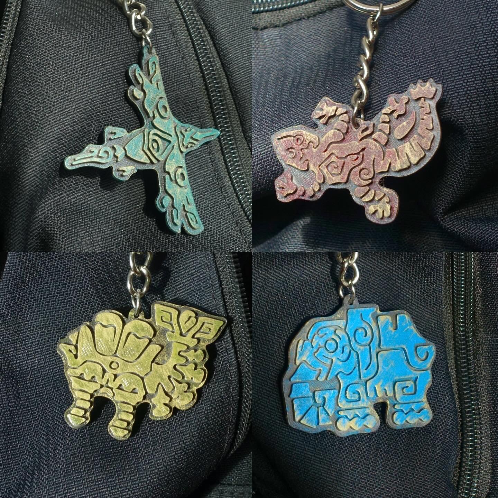
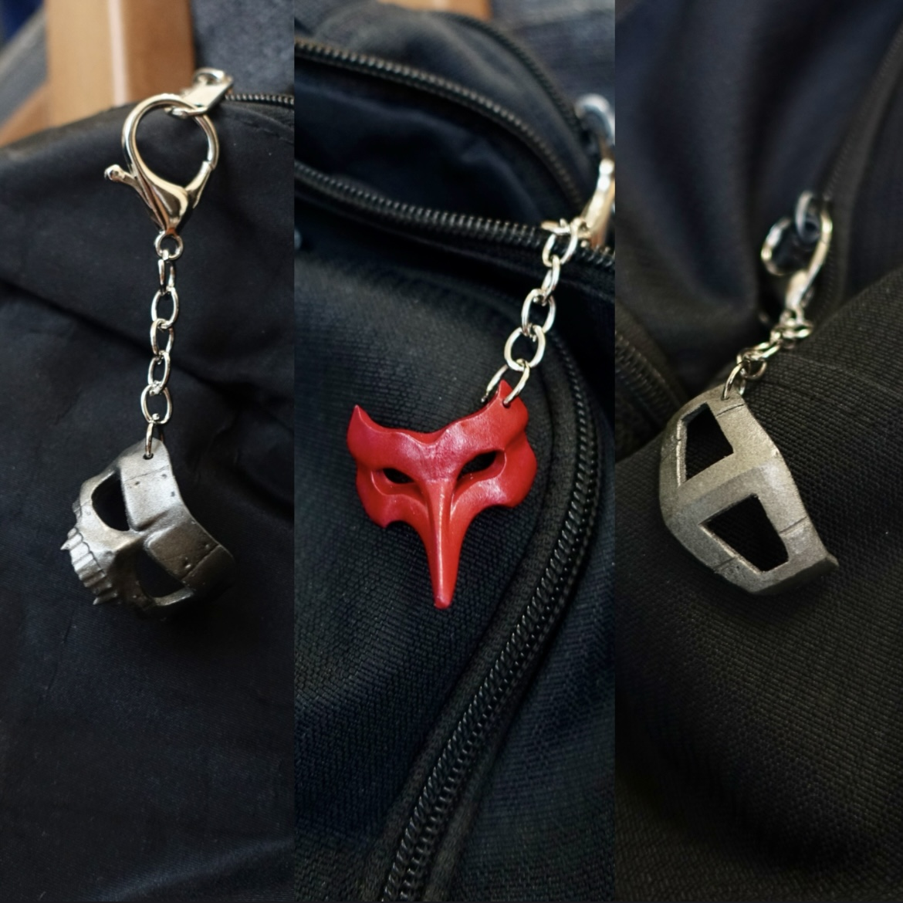
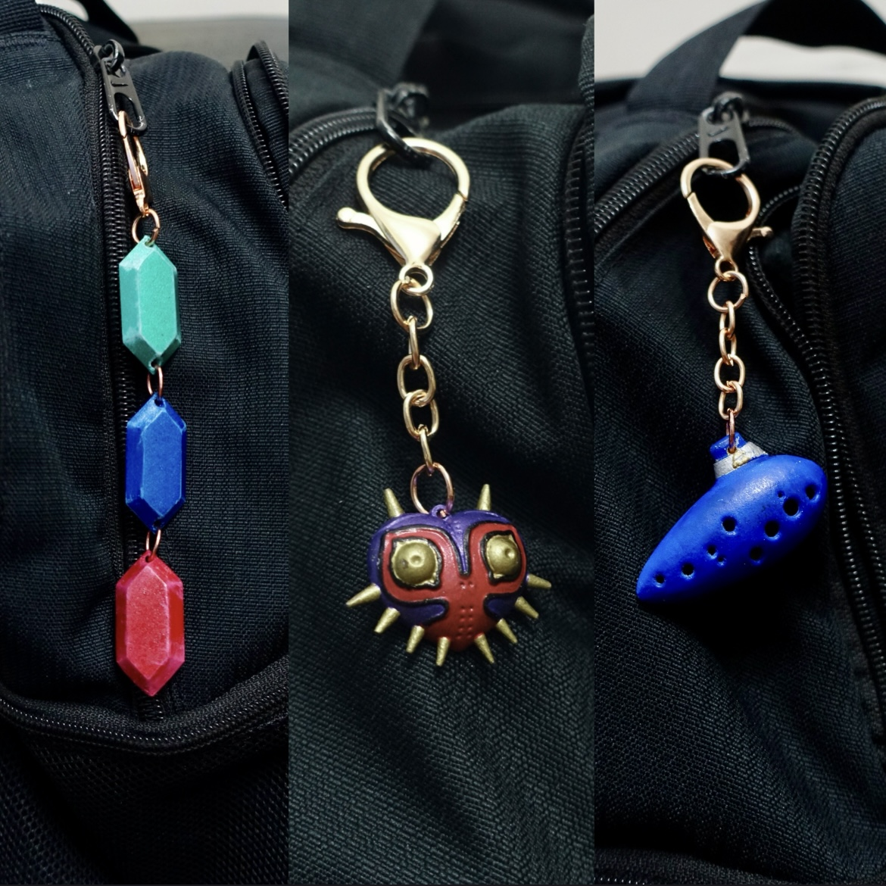

## Past Commissions/Products
I run a commission business with my partner. We use Blender, CAD, and 3d printing, and various materials to make people's favourite objects in life come to life. 

Inverse Spear

  

    

    
Reference

  

  

    

    
Result

  

Miside Chainsaw

  

    

    
Reference

  

  

    

    
Result

  

Alan Wake

  

    

    
Reference

  

  

    

    
Result

  

Alfonse

  

    

    
Reference

  

  

    

    
Result

  

Vigil

  

    

    
Reference

  

  

    

    
Result

  

## Other Merchandises

