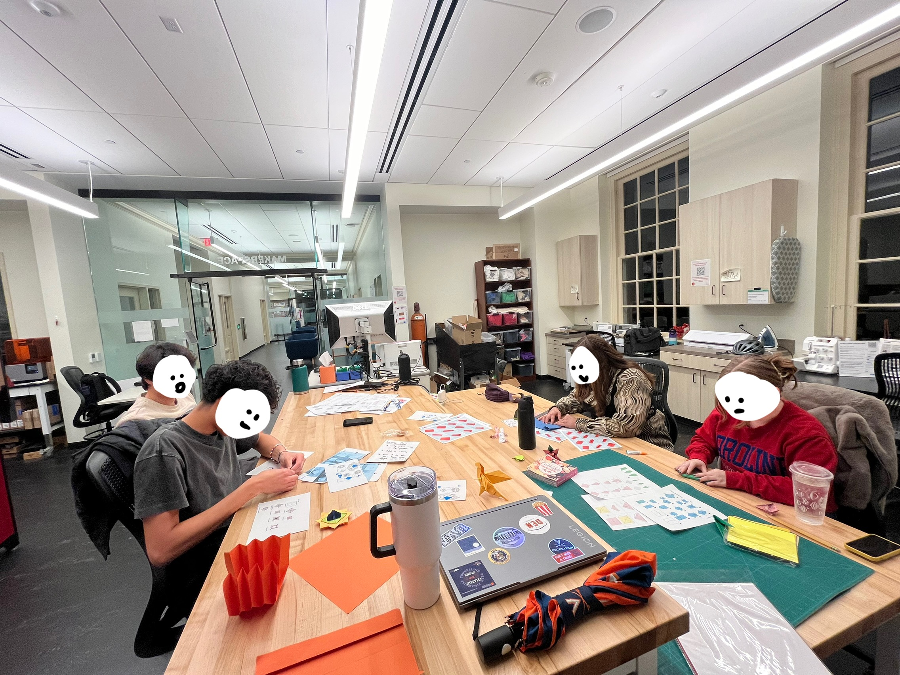
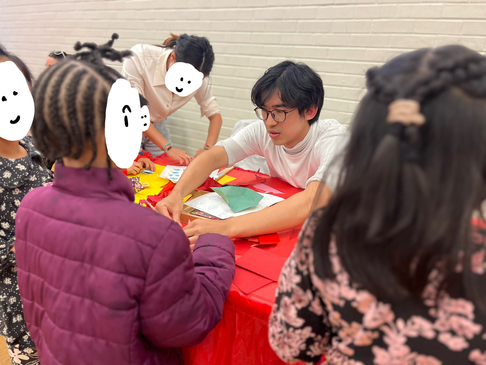
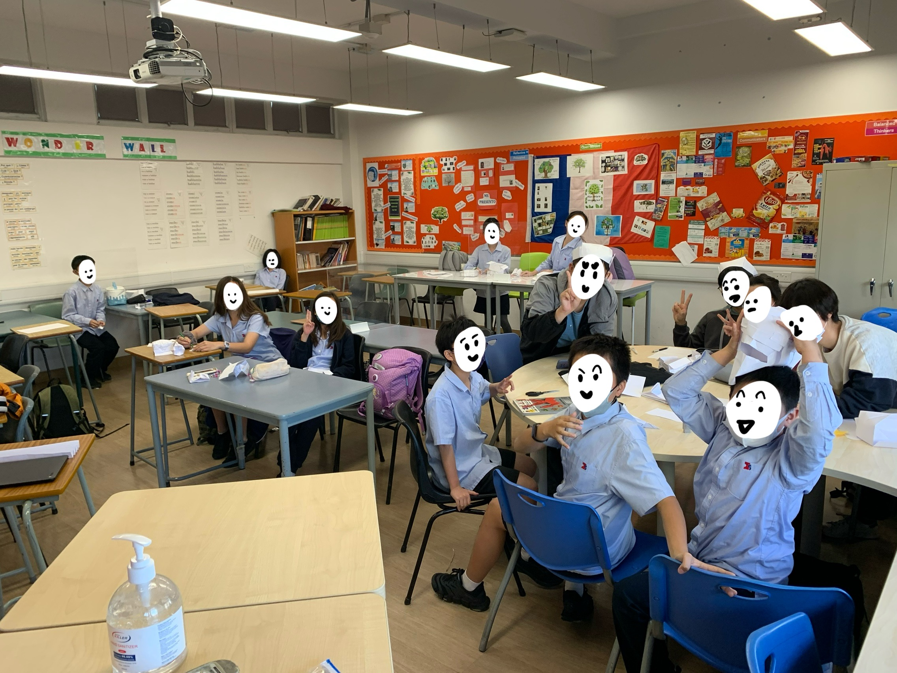

Origami is the art of folding a single (1) piece of paper. Here are some of my work.

  

    
Walking in the Rain - Chen Xiao

    
    
★★★★★★ Super long project (~15h) with very tedious crease pattern but the payoff was worth it. Beautiful design and the umbrella was very creative. One of my first advance project and holds a special place in my heart.

  

  

    
Nazgul - Jason Ku

    
    
 ★★★★★ If I recall correctly this one wasn't box pleated, yet the design nicely captured various features for both the Nazgul and the horse with a single sheet of paper. Details on the claw, mane, and the structure of the hood is very nice.

  

  

    
Maid — Chen Xiao

    
    
★★★★★ A fascinating design, both the humanoid shape and the garments are captured very well. Using foil paper gave it a glow that wasn't really captured in the image

  

  

    
SongBird — Robert J Lang

    
    
★★★☆☆ Simple, and elegant, but fragile. Added a metal wire to the inner frame to help it stand. 

  

  

    
Cat — Katsuta Kyohei

    
    
★★★★★ Evokes a joy of Origami when I fold this time and time again. Geometric, stylish, and satisfying, without being complicated 

  

  

    
Yodas — Fumiaki Kawahata

    
    
★★★★☆ Folded this one with a friend. Unexpectedly well designed with many satisfying steps, but also a few fustrating ones.

  

  

    
Pianist and Violinist — Robert J Lang

    
    
 ★★★★★ Simple, satisfying, great looking.

  

 
 
## Teaching
I've been teaching origami for the past 5 years and it's something I love. I've taught at highschool, college, for NGO, for Charlottesville, etc.

  

    
    
Shannon

  

  

    
    
Charlottesville New Year

  

  

    
    
High school

  

