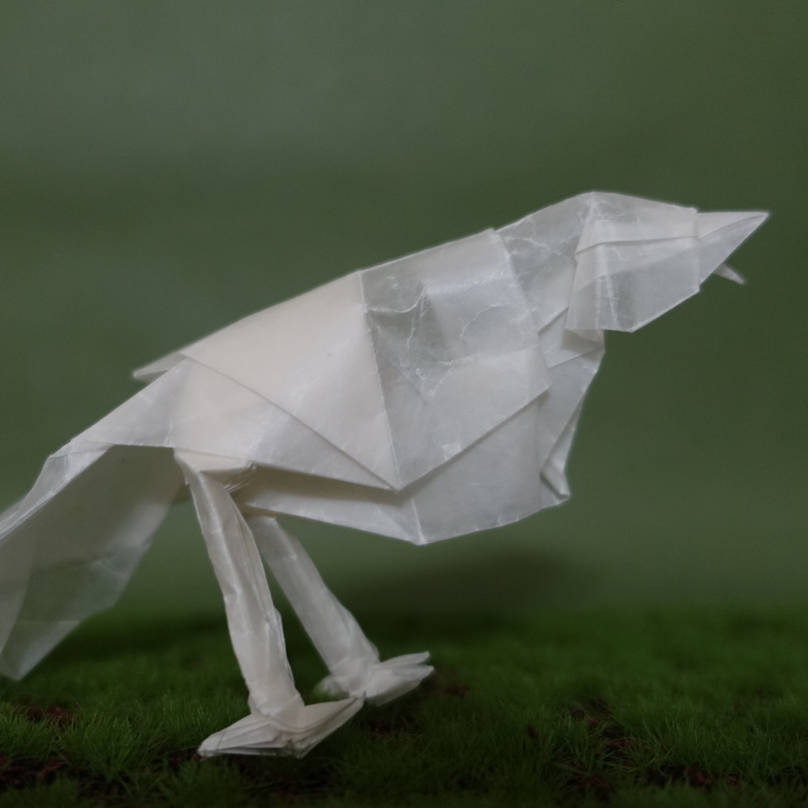
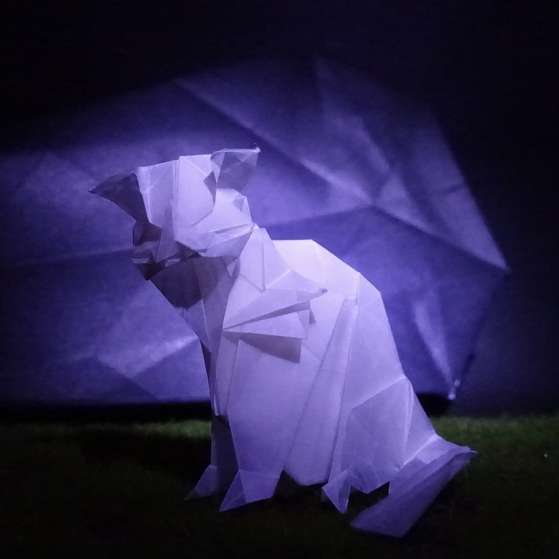
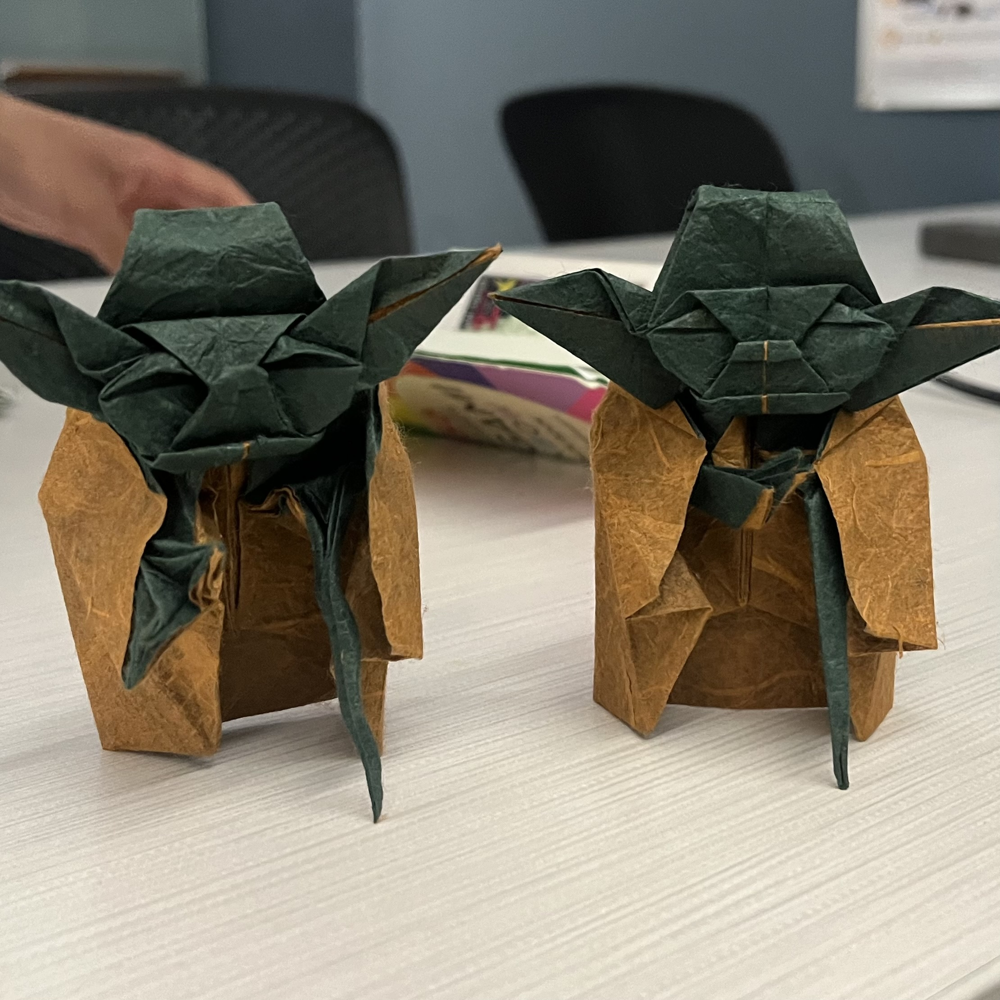

Origami is the art of folding a single (1) piece of paper. Here are some of my work.

  

    
    
★★★★★★ Super long project with very tedious crease pattern but the payoff was worth it. Beautiful design and the umbrella was very creative. Tracing the crease pattern took around 5 hours at least, folding more than 10. Holds a special place in my heart.

  

  

    
    
 ★★★★★ If I recall correctly this one wasn't box pleated, yet the design nicely captured various features for both the Nazgul and the horse with a single sheet of paper. Details on the claw, mane, and the structure of the hood is very nice.

  

  

    
    
★★★★★ A fascinating design, both the humanoid shape and the garments are captured very well. Using foil paper gave it a glow that wasn't really captured in the image

  

  

    
    
★★★★☆ Simple, and elegant, but fragile. Added a metal wire to the inner frame to help it stand. 

  

  

    
    
★★★★★ Evokes a joy of Origami when I fold this time and time again. Geometric, stylish, and satisfying, without being complicated 

  

  

    
    
★★★★☆ Folded this one with a friend. Unexpectedly well designed with many satisfying steps, but also a few fustrating ones.

  

  

    
    
 ★★★★★ Simple, satisfying, great looking.

  

(Left) Teaching in Shannon; (Right) Teaching in IRC